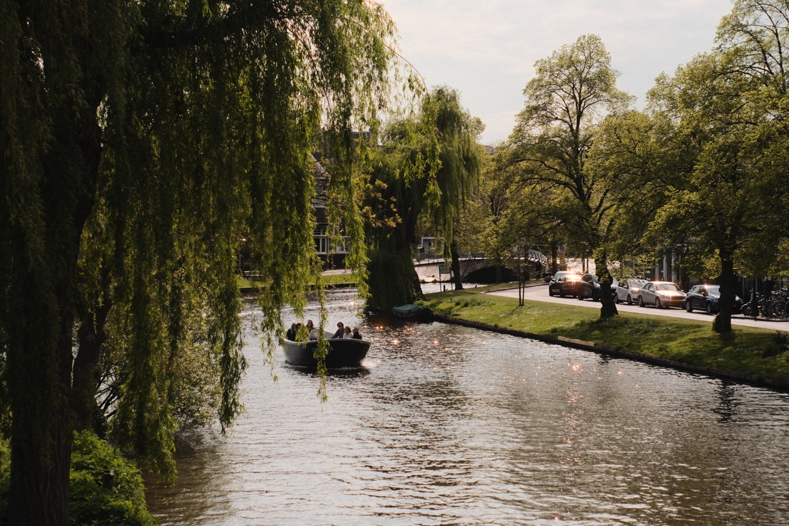

# py-digilation (Work In Progress)
---
PyDigilation - Film Halation Simulation for Digital Photos (In Python).
Experimenting with ChatGPT to generate code (the halation engine was mostly generated).
---

## Adding DigiLation (Digital Halation) to Photo Files

Run convert.py to add halation to photos in the input folder.

### Samples
Original (Leiden - NL)

Halation Applied (Leiden - NL)

Original (Berlin - DE)

Halation Applied (Berlin - DE)

---

## Webcam Live Demo

Run the live.py to show a live feed with the halation effect (including the masks used for the effect).

---
## Next Steps

- Make the effect configurable;
- Fine-tune the areas where the effect is applied (for example, only on hard transitions and light sources);
- Consider using AI to find the light sources and apply the effect only in that region;

---
